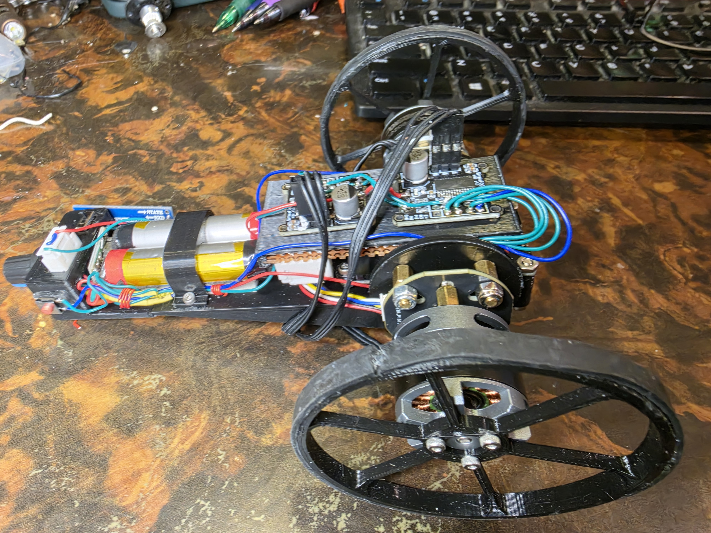
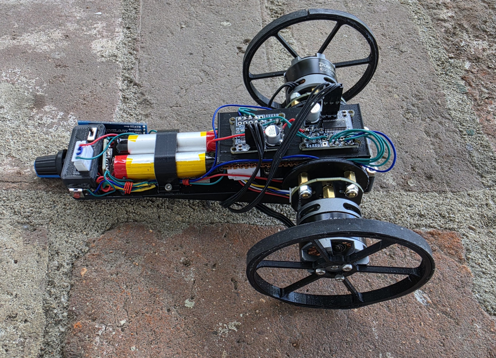

# Gimbal_Balance_Bot
Balance Bot with Gimbal motors

Uses 2ea. C2208-100T Gimbal motors, and a 3D printed chassis. ESP32 DEVKITV1, GY-BMI160 6 axis accelerometer/gyroscope, 2ea. Brushless Motor Controller (Simple FOC Mini drivers). 2ea. Li ion batteries, DC DC 5v converter. Start button, HM-10 BLE module, on/off switch, pot for fine position adjustment. Be sure to  configure the MT6701 motor encoders for SPI. needs a solder bridge across the 2 pads. Test the individual parts first (Tests ).

Remarkably stable. 

## Videos

[First successful balancing test](Videos/My Movie.mp4)

or, [Watch the Balance Bot test on YouTube](https://youtu.be/GpL1sepGrLg)